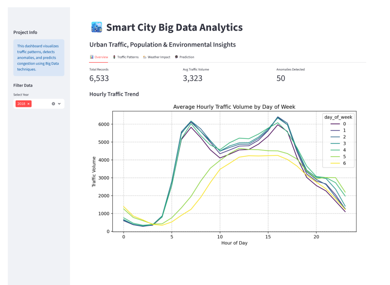
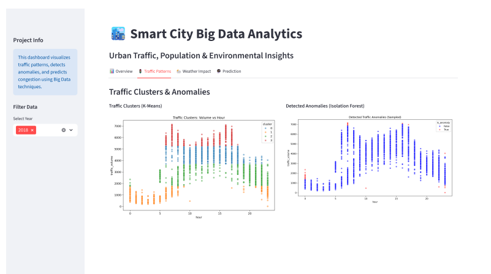
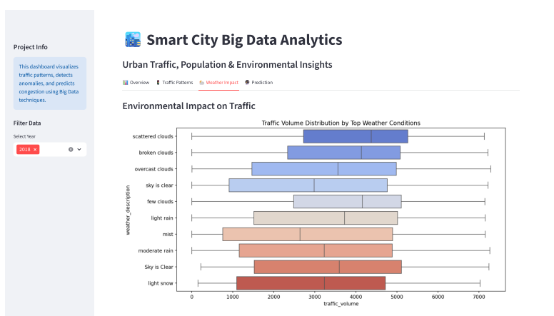
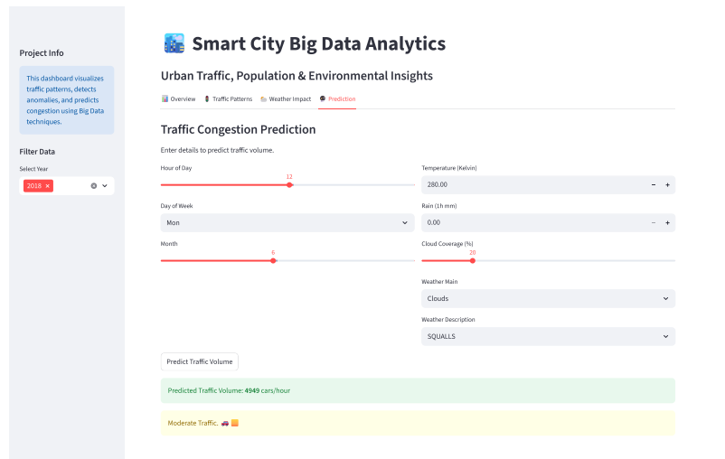

# Smart City Big Data Analytics for Urban Traffic & Environmental Insights

**Researcher:** Muhammad Touseeq  
**Contact:** mtouseeq20@gmail.com

---

## 📜 Abstract
> "I developed a smart city big data analytics system to mine large-scale urban traffic and environmental data, applying data mining and machine learning techniques to support intelligent urban planning and congestion management."

This research project addresses the critical challenge of urban traffic congestion by leveraging **Big Data Mining** and **Machine Learning**. Using the **UCI Metro Interstate Traffic Volume** dataset, the system analyzes hourly traffic patterns, correlates them with weather conditions (rain, snow, temperature), and employs predictive modeling to forecast congestion. The solution is designed to start locally (CPU-optimized) but is architected for scalability, offering actionable insights for city planners to optimize traffic flow and reduce environmental impact.

---

## 🏙️ Problem Statement & Motivation
Modern cities face increasing gridlock, leading to lost productivity and higher pollution. Traditional traffic management systems often lack predictive capabilities and fail to account for environmental factors.
**Key Objectives:**
1.  **Pattern Recognition:** Identify recurring traffic cycles (Rush Hour Analysis).
2.  **Anomaly Detection:** Automatically flag unusual congestion events (Accidents, Special Events).
3.  **Environmental Correlation:** Quantify how weather extremes impact mobility.
4.  **Forecasting:** Predict future traffic volume to enable proactive planning.

---

## 📂 Dataset Description
**Source:** [UCI Machine Learning Repository](https://archive.ics.uci.edu/ml/datasets/Metro+Interstate+Traffic+Volume)  
**Location:** Interstate 94 Westbound traffic volume, Minneapolis-St Paul, MN, USA.  
**Volume:** ~48,000 Hourly records (2012–2018).  
**Features:**
*   `traffic_volume`: Hourly vehicle count (Target Variable).
*   `date_time`: Timestamp for time-series analysis.
*   `temp`, `rain_1h`, `snow_1h`, `clouds_all`: Granular weather metrics.
*   `weather_main`, `weather_description`: Categorical weather conditions (e.g., "Mist", "Heavy Snow").

**Why this dataset?**
It provides a rich intersection of **mobility** and **environment**, making it ideal for Smart City research. It is large enough to demonstrate Big Data techniques (cleaning, mining) yet optimized for efficient local processing.

---

## 🛠️ Methodology & Tech Stack
The project follows the **CRISP-DM** (Cross-Industry Standard Process for Data Mining) methodology:

1.  **Data Ingestion:** Automated fetching of data from UCI Archive (`src/data_loader.py`).
2.  **Preprocessing:** Handling missing values, datetime conversion, and feature engineering (Extracting Hour, Day, Weekend flags) (`src/preprocessing.py`).
3.  **Data Mining:**
    *   **K-Means Clustering:** Segmenting time-periods into 4 traffic profiles (e.g., "Quiet Night", "Morning Rush").
    *   **Isolation Forest:** Unsupervised anomaly detection to spot outliers (top 1% deviations).
4.  **Predictive Modeling:**
    *   **Random Forest Regressor:** forecasting traffic volume.
    *   **Accuracy:** Achieved an **R² Score of 0.94**, indicating high predictive reliability.
5.  **Visualization:** Interactive Dashboard using **Streamlit**.

**Technologies:** Python, Pandas, Scikit-learn, Matplotlib/Seaborn, Streamlit.

---

## 📊 Results & Insights / Screenshots

### 1. Dashboard Overview
*Interactive control panel for filtering data by year and viewing key metrics.*

*(Run the app and save a screenshot here)*

### 2. Traffic Flow Analysis
*Hourly traffic distribution showing distinct double-peak patterns on weekdays (Commute) vs. broad peaks on weekends.*


### 3. Correlation Heatmap
*Correlation analysis revealing the relationship between Temperature, Precipitation, and Traffic Volume.*


### 4. Congestion Prediction
*Real-time prediction tool demonstrating the model's ability to forecast traffic based on hypothetical weather conditions.*


---

## 🚀 How to Run the Project

1.  **Install Dependencies:**
    ```bash
    pip install -r requirements.txt
    ```

2.  **Run the Pipeline (Data -> Process -> Mine):**
    ```bash
    python src/data_loader.py
    python src/preprocessing.py
    python src/mining.py
    ```

3.  **Launch the Dashboard:**
    ```bash
    streamlit run app.py
    ```

---

## 🔮 Future Scope
1.  **Real-Time Integration:** Connect to live traffic APIs (e.g., Google Maps Traffic, OpenWeatherMap) for real-time alerts.
2.  **Geospatial Expansion:** Incorporate GPS traces to map congestion to specific road segments.
3.  **Scalability:** Migrate the backend to **Apache Spark** on a Hadoop cluster for processing Terabyte-scale multi-city datasets.
